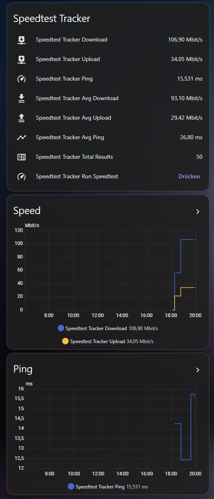

# Speedtest Tracker for Home Assistant

A custom Home Assistant integration for [Speedtest Tracker](https://github.com/alexjustesen/speedtest-tracker) with config flow setup, average statistics, recent results, and a button to start a new speedtest directly from Home Assistant.

[](https://my.home-assistant.io/redirect/hacs_repository/?owner=GhostDragon5&repository=ha-speedtest-tracker&category=integration)

## Features

- UI setup through Home Assistant config flow
- Latest Speedtest Tracker result in Home Assistant
- Average download, upload, and ping from the Speedtest Tracker stats API
- Button entity to start a new speedtest
- English and German translations
- Optional alive / reachable sensor for instance availability

## Installation

### Option 1: Add via the button above

Click the badge above to open the repository directly in Home Assistant / HACS.

### Option 2: Add manually in HACS

1. Open **HACS**
2. Open the **Integrations** page
3. Open the menu in the top right
4. Select **Custom repositories**
5. Add this repository URL:
   `https://github.com/GhostDragon5/ha-speedtest-tracker`
6. Select category **Integration**
7. Click **Add**
8. Install the integration
9. Restart Home Assistant

## Setup

1. Go to **Settings -> Devices & Services**
2. Click **Add Integration**
3. Search for **Speedtest Tracker**
4. Enter:
   - Base URL
   - API token
   - Polling interval

## Entities

### Sensors

- Download
- Upload
- Ping
- Jitter
- Packet Loss
- ISP
- Server Name
- Status
- Avg Download
- Avg Upload
- Avg Ping
- Total Results

### Button

- Run Speedtest

### Optional

- Alive / Reachable binary sensor

## API endpoints used

- `GET /api/v1/results/latest` for the latest result
- `GET /api/v1/stats` for average values and total result count
- `POST /api/v1/speedtests/run` to trigger a new test

## Example dashboard

```yaml
type: vertical-stack
cards:
  - type: entities
    title: Speedtest Tracker
    entities:
      - entity: sensor.speedtest_tracker_download
      - entity: sensor.speedtest_tracker_upload
      - entity: sensor.speedtest_tracker_ping
      - entity: sensor.speedtest_tracker_avg_download
      - entity: sensor.speedtest_tracker_avg_upload
      - entity: sensor.speedtest_tracker_avg_ping
      - entity: sensor.speedtest_tracker_total_results
      - entity: button.speedtest_tracker_run_speedtest

  - type: history-graph
    title: Speed
    hours_to_show: 14
    entities:
      - entity: sensor.speedtest_tracker_download
      - entity: sensor.speedtest_tracker_upload

  - type: history-graph
    title: Ping
    hours_to_show: 14
    entities:
      - entity: sensor.speedtest_tracker_ping
```

## Example dashboard Screenshot



## Notes

- The `healthy` field from Speedtest Tracker can be `null`, depending on the API response
- If you want a real online / offline state, use an alive / reachable binary sensor instead of relying only on the nullable `healthy` field
- After starting a speedtest, it may take a short moment until the new result is available through the API

## HACS

Minimal `hacs.json`:

```json
{
  "name": "Speedtest Tracker",
  "render_readme": true
}
```

## Credits

- [Speedtest Tracker](https://github.com/alexjustesen/speedtest-tracker)
- [Home Assistant](https://www.home-assistant.io/)
- [HACS](https://www.hacs.xyz/)